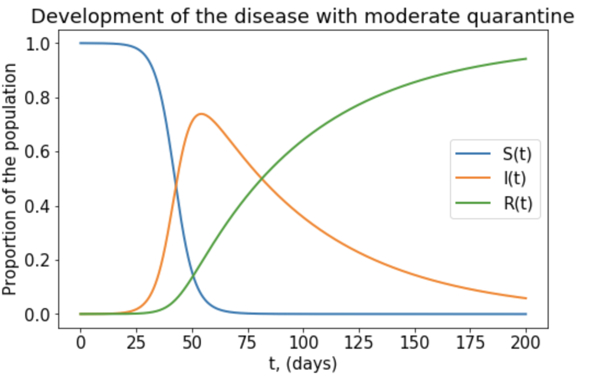

# CoronaVirus Infection Prediction

For this simulation, I am exploring the potential infection rates of the population based on interaction rates among the people and vacciantion on March 5th, 2020.

The symptoms of the virus are difficulty in breathing, fever, and cough. On March 5th, there are 95,333 cases of infection confirmed and 3282 deaths, resulting in 3282/95,333= 3.4% lethality rate (WHO, 2020). I will explore the case for China, where there are 80 565 confirmed cases and 3015 deaths on March 5th (WHO, 2020). The SIR model includes three differential equations:

𝑑𝑆𝑑𝑡=−𝑏𝑐𝑆(𝑡)𝐼(𝑡)−𝑣
 
𝑑𝐼𝑑𝑡=(𝑏𝑐𝑆(𝑡)−𝑘)𝐼(𝑡)
 
𝑑𝐼𝑑𝑡=𝑘𝐼(𝑡)+𝑣

Where S(t) = 1,428,095,506 = the number of susceptible people at time

t - population of China minus infected and recovered (WHO, 2020)

I(t) = 80,565 the number of infected people at time t (starting from March 5th in China)

R(t) = 53,929 the number of recovered people at time t (Worldometers, March 6th 2020)

b = 0.050065 = transmition per contact (what is the chance of the person to get infected per 1 contact with the person that is already infected)

c = 13.4 average number of contacts per person per day (Massong, et al, 2008). If c = 13.4 in normal everyday interaction, then it means that no quarantine is in place. If full quarantine is in place, then the c= 1

k = 0.0181 is the recovery rate (Yu, 2020). WHO is an official website of the World Health Organization and the data on Worldometers matches the data on WHO website. I have estimated the recovery rate to CHina population based on the worldwide trends.

v = the number of vaccinated people per day (for the code, I have tried out several values)

## INFERENCE:

### CONTACTS PER DAY:

If we limit the interactions of infected people to 1 (put full quarantine), then the proportion of infected people goes to 0.25. If we put it to 5 people per day, then the peak of infected people is at day 60 with approximately 70% of the people infected. If we leave it 13.4 - the normal daily interaction, then apr. 85% of the population will be infected peaking on the 20th day. The contact rate is not adjusted to specific interaction of Chinese people, therefore, the numbers should be approached with doubts. This simulation represents the overall trends of the virus and implies that only full quarantine can prevent a massive spread of the virus.

### VACCINATION: 

The levels of vaccination do not significantly influence the epidemy flow unless we vaccinate almost all the people right away. Even if we proceed with 10,000 a day, the changes of proportion of infected are not visual on graph, but it decreases numerically slightly. Therefore, only total vaccination can help prevent the spread of the disease, but for the further considerations to avoid the repetition of the pandemic, people should be vaccinated.

-----------------------------------------------------------
Citation: Coronavirus disease 2019 (COVID-19) Situation Report – 45.World Health Organizations. March 6th, 2020. Retrieved from https://www.who.int/docs/default-source/coronaviruse/situation-reports/20200305-sitrep-45-covid-19.pdf?sfvrsn=ed2ba78b_2

Worldometers.info.March 6th, 2020. Retrieved from https://www.worldometers.info/coronavirus/#countries

Yu, X. Jan 25, 2020. Updated Estimating Infected Population of Wuhan Coronavirus in different policy scenarios by SIR Mode. Retrieved from uni-goettingen.de/en/infectious+diseases/619691.html

Stanway D., February 28, 2020. Explainer: Coronavirus reappears in discharged patients, raising questions in containment fight. Reuters. Retrived from https://www.reuters.com/article/us-china-health-reinfection-explainer/explainer-coronavirus-reappears-in-discharged-patients-raising-questions-in-containment-fight-idUSKCN20M124

